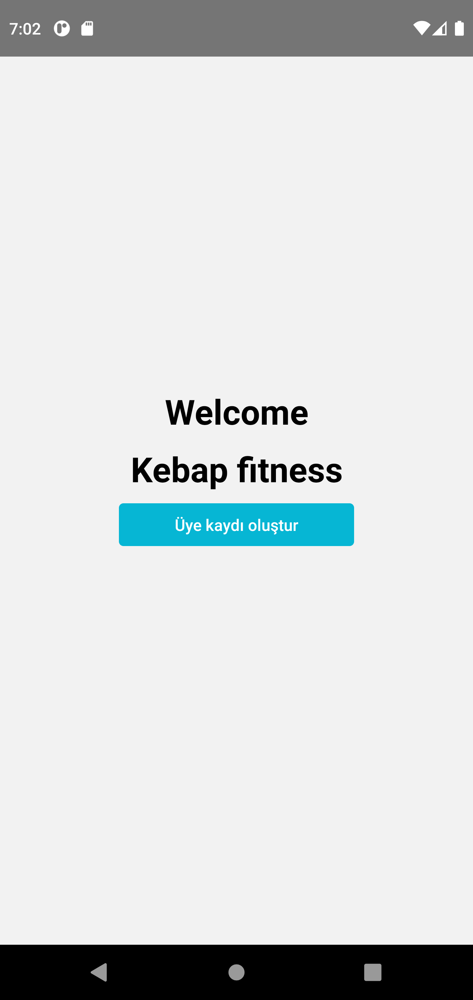
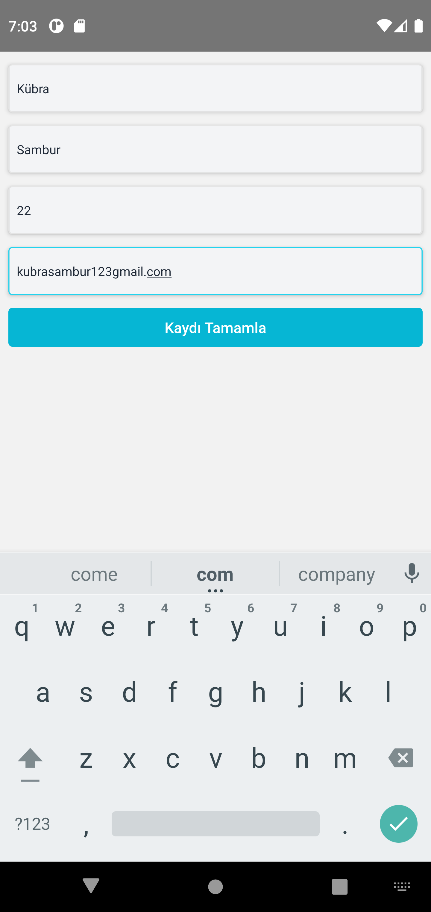

# React-Native-FitnessApp

[Patika.dev](https://app.patika.dev/) Project assignment I developed to reinforce what I learned in React Native trainings.

## Features
- react navigation used
- switch between pages
- The information entered in the form has been moved to another page.

## Özellikler
- react navigation kullanıldı
- sayfalar arası geçiş yapıldı
- Forma girilen bilgiler başka sayfaya aktarıldı

## Images




## Installation
Clone this repository on your local machine.

```
git clone https://github.com/kubrasambur/React-Native-FitnessApp.git
```

## Usage
To use it after cloning the project:
```
cd ToDo
cd .
```
Run the following commands in the project folder to install the project dependencies.

```
npm init
npm install
```
These instructions will get a copy of the project up and running on your local machine for development and testing purposes.

## To Run the Application
In the project directory you can run:

```
npx react-native run-android
```
## For More Information
You can review the [React Native](https://reactnative.dev/) documentation.
